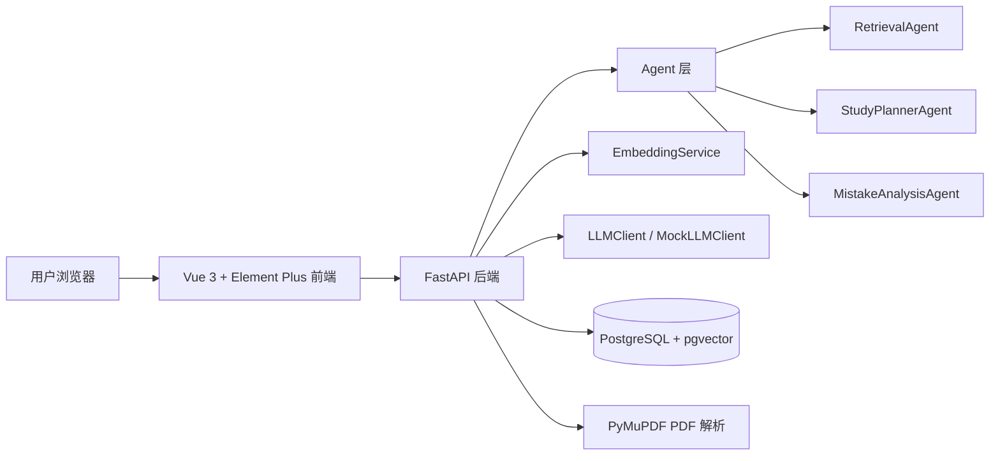

# ScholarPilot

ScholarPilot 是一个基于 Agentic RAG 的学术资料智能问答与学习规划系统，面向计算机科学与技术、人工智能、软件工程方向的研究生申请项目展示。系统支持用户认证、PDF 学术资料上传、文档解析、chunk 切分、向量化存储、基于 pgvector 的检索增强问答、答案来源引用、学习计划生成、错题分析和数据统计。

## 项目亮点

- 完整 RAG 链路：PDF 解析、文本切分、embedding、pgvector 检索、上下文拼接、LLM 回答、confidence 与引用返回。
- Agentic 设计：内置 RetrievalAgent、StudyPlannerAgent、MistakeAnalysisAgent，职责清晰，便于扩展。
- 可演示性强：没有真实大模型 API 时自动使用 mock LLM，保证问答、计划和错题分析流程可运行。
- 工程结构完整：FastAPI 分层后端、Vue 3 管理台前端、PostgreSQL + pgvector、Docker Compose 一键启动。
- 面向申请展示：文档、报告、简历描述齐备，可体现 AI、数据库、软件工程和产品化能力。

## 技术栈

前端：Vue 3、Vite、Element Plus、Axios、ECharts  
后端：Python、FastAPI、SQLAlchemy、Pydantic、JWT  
数据库：PostgreSQL、pgvector  
AI / RAG：sentence-transformers、可替换 LLMClient、mock LLM fallback  
文档解析：PyMuPDF  
部署：Docker、Docker Compose、Nginx

## 系统架构



## 功能模块

- 用户模块：注册、登录、JWT 鉴权、当前用户信息。
- 文档模块：PDF 上传、解析、chunk 切分、向量化、列表、详情、删除。
- RAG 问答模块：问题 embedding、Top-K 检索、上下文构造、回答生成、来源引用、confidence、会话历史。
- 学习计划模块：根据目标、基础、周期和每周投入生成学习计划。
- 错题模块：记录错题，自动分析错因和知识点，支持统计。
- 数据统计模块：资料数量、chunk 数、问答会话、错题分布、资料分类图表。

## RAG 工作流程

1. 用户上传 PDF。
2. 后端使用 PyMuPDF 提取每页文本。
3. 按页码和段落切分 chunk，并保留 page_number、chunk_index、section_title。
4. 使用可配置的 sentence-transformers 模型生成 embedding；若模型暂不可用，使用 deterministic hash embedding 保证演示。
5. embedding 写入 PostgreSQL 的 pgvector 字段。
6. 用户在 AI 问答页提问。
7. 系统生成问题 embedding。
8. pgvector 使用 cosine distance 检索 Top-K chunk。
9. 后端拼接 context。
10. LLMClient 生成回答；未配置真实 API 时使用 MockLLMClient。
11. 返回 answer、sources、confidence，并保存到 chat history。

每条 `source` 至少包含：

- `document_name`：引用来源文件。
- `page_number`：PDF 页码，方便回看原文。
- `chunk_index`：页内切片序号，方便定位上下文。
- `chunk_text`：被检索命中的原文片段。
- `similarity`：问题向量与片段向量的相似度。

引用来源是可信 RAG 的关键：系统不只给出自然语言回答，还暴露回答依据，让用户可以判断答案是否确实来自上传资料，降低幻觉风险，并方便在学术阅读、面试复盘和项目展示中追溯原文。

## Embedding 模型配置

默认模型保持轻量：

```bash
EMBEDDING_MODEL=sentence-transformers/all-MiniLM-L6-v2
```

后续可切换为更适合中英文或长文本场景的模型：

```bash
EMBEDDING_MODEL=BAAI/bge-m3
EMBEDDING_MODEL=intfloat/multilingual-e5-base
```

embedding 做成可配置，是为了在“演示稳定”和“检索效果升级”之间保持弹性：MVP 默认模型下载较小、启动较快；如果后续追求中文学术资料效果，可以替换模型并重新向量化文档。注意：不同模型输出维度可能不同，切换时需要同步调整 `EMBEDDING_DIMENSION`，并重建或重新上传文档以生成新的向量。

## Confidence 设计

`/chat` 会返回 `confidence`，取值为 `high`、`medium`、`low`。当前版本采用轻量规则：

- 最高 similarity 较高，并且可靠来源数量充足，则为 `high`。
- 有来源但 similarity 一般，则为 `medium`。
- 没有来源或相似度过低，则为 `low`。

confidence 不是事实正确性的严格证明，而是一个可解释的检索质量提示，帮助用户判断当前回答是否值得信任，以及是否需要继续上传资料或改写问题。

## 数据库设计

核心表包括：

- users：用户账号、邮箱、密码哈希、创建时间。
- documents：用户资料、文件名、类型、摘要、分类。
- document_chunks：页码、chunk 序号、文本、embedding、章节标题。
- chat_sessions：用户问答会话。
- chat_messages：用户/助手消息、来源引用。
- mistake_records：错题、用户答案、正确答案、错因、知识点。
- study_plans：学习目标、计划内容。

## Docker 启动方式

```bash
docker compose up --build
```

启动后访问：

- 前端：http://localhost:5173
- 后端 API：http://localhost:8000
- API 文档：http://localhost:8000/docs
- PostgreSQL：localhost:5432

默认账号需要在前端注册。默认 LLM_PROVIDER 为 mock，因此不配置外部 API 也能演示完整功能。

## 本地开发方式

后端：

```bash
cd backend
python -m venv .venv
source .venv/bin/activate
pip install -r requirements.txt
uvicorn app.main:app --reload
```

前端：

```bash
cd frontend
npm install
npm run dev
```

本地开发需要 PostgreSQL + pgvector。可以只启动数据库：

```bash
docker compose up db
```

## 接入真实 LLM

后端通过 `backend/app/services/llm_client.py` 提供可替换接口。可在环境变量中配置 OpenAI / DeepSeek / Ollama 兼容的 Chat Completions 服务：

Docker 方式建议先复制根目录环境变量模板：

```bash
cp .env.example .env
```

然后在根目录 `.env` 中配置：

```env
LLM_PROVIDER=openai-compatible
LLM_API_BASE=https://api.openai.com/v1
LLM_API_KEY=your-key
LLM_MODEL=gpt-4o-mini
```

本地后端开发方式可以复制 `backend/.env.example` 为 `backend/.env` 后填写同样的变量。

如果使用 DeepSeek 或本地 Ollama，只要服务兼容 Chat Completions 格式，就把 `LLM_API_BASE` 和 `LLM_MODEL` 换成对应地址与模型名即可。未配置真实服务时保持 `LLM_PROVIDER=mock`，系统仍能完成上传、检索、引用来源和 mock 回答演示。

## 当前版本不足与后续计划

当前版本仍是稳定可演示的 MVP，主要不足包括：只使用向量检索，暂未加入关键词检索；PDF 解析以文本型 PDF 为主；confidence 规则较轻量；缺少系统化 RAG 评估和自动化测试。

后续计划：

- Hybrid Search：结合向量检索与关键词检索。
- Reranker：对 Top-K 结果二次排序，提高引用质量。
- Redis + Celery：将 PDF 解析和 embedding 改为后台任务。
- OCR：支持扫描版 PDF。
- 知识图谱：沉淀课程知识点和错题关系。
- RAG 评估面板：展示命中率、引用覆盖率、相似度分布和回答质量。
- pytest：补充后端接口和服务层测试。
- Alembic：管理数据库迁移。

## 项目截图占位说明

建议在完成演示数据后补充以下截图：

- 登录与注册页
- Dashboard 总览页
- PDF 上传与文档 chunk 详情页
- AI 问答与来源引用页
- 学习计划生成页
- 错题分析与统计页

## GitHub 发布

发布前请参考 [docs/github_publish_guide.md](docs/github_publish_guide.md)，重点确认 `.env`、真实 API Key、上传文件、`node_modules` 和构建产物不会被提交。

## 研究生申请中的项目价值

ScholarPilot 能展示申请者对人工智能应用系统的完整理解：从 RAG 算法流程、向量数据库、Agent 角色拆分，到 Web 工程、数据库建模、Docker 部署和产品化演示。项目既能作为 AI/软件工程方向的作品集，也能自然延展为研究计划，例如个性化学习、可信问答、教育智能体、多源学术知识库和检索增强生成评估。
