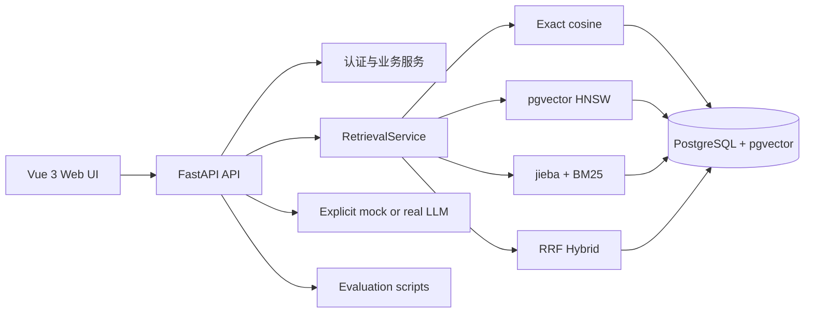

# ScholarPilot

ScholarPilot 是一个面向学术 PDF 的可追溯 RAG 检索系统与可复现实验平台。系统保留用户认证、文档管理、问答、学习计划、错题分析和数据统计，并重点解决三个问题：检索结果从哪里来、运行时实际用了什么模型、不同检索方法如何被重复评估。

## 能力边界

- `sources`、编号引用与 `citation_validity` 提供来源可追溯性，但不等于事实核验。
- `evidence_strength` 只描述检索证据强弱，不是答案正确率、模型置信概率或学术结论保证。
- `mock` 是明确标记的演示模式。真实 LLM 失败时返回 `degraded` 状态，不会用 mock 内容伪装成功。
- hash embedding 默认禁用。只有显式设置 `ALLOW_EMBEDDING_FALLBACK=true` 才能启用，且状态页会显示 fallback。
- 仓库中的 `demo-v1` 是合成小样本，只用于验证实验链路，不能代表真实学术语料效果。

## 系统亮点

- 四种统一检索基线：pgvector 精确余弦、HNSW、基于 jieba 的 BM25、基于 RRF 的 Hybrid Search。
- 全链路用户隔离：向量 SQL 和 BM25 缓存均按 `user_id` 约束。
- 模型版本追踪：每个文档记录 embedding 模型、维度、版本和索引状态；不兼容时拒绝检索并要求重新索引。
- 引用校验：回答使用 `[1]`、`[2]` 编号，服务端校验编号是否存在并返回实际引用的 chunk ID。
- 运行真实性：`/health/details` 和前端“运行状态”页展示模型、mock/fallback、数据库和 pgvector 状态。
- 可复现实验：输出 Recall@5、Recall@10、MRR、nDCG@10、P50/P95/P99、QPS、配置和逐查询原始结果。
- 工程基线：Alembic、pytest、GitHub Actions、Docker Compose、文件校验、线程池解析和路由级动态加载。

## 技术栈

前端：Vue 3、Vite、Element Plus、Axios、ECharts  
后端：FastAPI、SQLAlchemy、Pydantic、JWT、Alembic
数据库：PostgreSQL 16、pgvector
检索：sentence-transformers、pgvector HNSW、jieba、rank-bm25、RRF
文档：PyMuPDF
部署与质量：Docker Compose、pytest、ruff、GitHub Actions

## 系统架构



PDF 解析与 embedding 在线程池中执行，避免阻塞 FastAPI event loop。正式表结构由 Alembic 管理；`database/init.sql` 只负责启用 pgvector 扩展。

## 检索方法

| 模式 | 实现 | 用途 | 返回信息 |
| --- | --- | --- | --- |
| `exact` | pgvector cosine distance，禁用近似索引 | 精确基线 | `similarity`、`vector_rank` |
| `hnsw` | `vector_cosine_ops` HNSW | 近似向量检索 | `similarity`、`vector_rank`、实际 HNSW 参数 |
| `bm25` | jieba 可复现分词 + BM25Okapi | 术语和关键词检索 | `lexical_score`、`lexical_rank` |
| `hybrid` | BM25 + 向量候选，RRF 合并 | 默认检索 | 两类 rank、`fused_score` |

HNSW 的 `m` 与 `ef_construction` 在迁移创建索引时生效；`ef_search` 在每次查询事务中设置。Hybrid 默认以 HNSW 作为向量分支，候选集和 RRF `k` 均可配置。

## RAG 工作流程

1. 校验 PDF 扩展名、内容头和大小，保存原文件。
2. PyMuPDF 解析文本，按页和段落切分 chunk。
3. 生成 embedding，校验输出维度并写入 pgvector。
4. 文档记录模型、维度、版本和 `indexing_status`。
5. 提问时先检查文档向量版本与当前查询模型是否一致。
6. 按 `retrieval_mode` 检索，并始终用 `user_id` 隔离。
7. 计算 `evidence_strength`；低于阈值时不调用 LLM。
8. 将来源编号为 `[1]`、`[2]` 后调用显式配置的 LLM。
9. 校验回答中的引用编号，返回 `citation_validity` 和 `cited_source_ids`。
10. 保存回答、来源、检索配置和运行元数据。

`POST /chat` 保留原有 `answer`、`sources`、`confidence` 和 `session_id` 字段。`confidence` 仅作为旧客户端兼容字段，值与 `evidence_strength` 相同，新代码应使用后者。

## 运行状态

`GET /health/details` 返回：

- `active_embedding_backend`、`embedding_model`、`embedding_dimension`
- `embedding_model_loaded`、fallback 是否允许和是否启用
- `llm_provider`、`llm_mode`、`llm_model`
- `database_status`、`pgvector_status`

系统不会通过健康检查主动下载模型。模型尚未发生首次推理时，`embedding_model_loaded=false` 是正常状态。

## 数据库与迁移

核心表包括 `users`、`documents`、`document_chunks`、`chat_sessions`、`chat_messages`、`study_plans` 和 `mistake_records`。

新增文档字段：

- `embedding_model`
- `embedding_dimension`
- `embedding_version`
- `indexing_status`
- `indexing_error`

新增聊天记录字段保存 `runtime_metadata`、`evidence_strength`、引用校验和引用 chunk ID。HNSW 索引由 `0002_research` 迁移创建。

原 MVP 数据库没有模型元数据。首次迁移会将旧文档标记为 `requires_reindex`，不会猜测其模型版本；请在文档页点击“重新索引”。

```bash
cd backend
alembic current
alembic upgrade head
```

## Docker 启动

```bash
cp .env.example .env
docker compose up --build -d
docker compose ps
```

访问：

- Web：<http://localhost:5173>
- API 文档：<http://localhost:8000/docs>
- 详细状态：<http://localhost:8000/health/details>

默认 `LLM_PROVIDER=mock`，界面和 API 会明确显示 mock。接入 OpenAI-compatible 服务时配置 `LLM_PROVIDER`、`LLM_API_BASE`、`LLM_API_KEY` 和 `LLM_MODEL`；真实服务失败会返回降级状态，不会自动换成 mock。

## 关键配置

```dotenv
EMBEDDING_MODEL=sentence-transformers/all-MiniLM-L6-v2
EMBEDDING_DIMENSION=384
EMBEDDING_VERSION=1
EMBEDDING_BACKEND=auto
ALLOW_EMBEDDING_FALLBACK=false

RETRIEVAL_MODE=hybrid
RETRIEVAL_CANDIDATE_K=20
RETRIEVAL_MIN_RELEVANCE=0.25
HYBRID_RRF_K=60
HNSW_M=16
HNSW_EF_CONSTRUCTION=64
HNSW_EF_SEARCH=40
```

切换 embedding 模型时必须同步确认向量维度并重新索引。已经建立的 pgvector 列维度无法只靠环境变量改变，变更维度需要新的数据库迁移。

## 本地开发

```bash
# 后端
cd backend
python3 -m venv .venv
source .venv/bin/activate
pip install -r requirements.txt
alembic upgrade head
uvicorn app.main:app --reload

# 前端
cd frontend
npm ci
npm run dev
```

## 测试与构建

```bash
make test
make build
make verify
```

pytest 使用 deterministic fake embedding 和 mock client，不访问外部模型或网络。CI 会运行后端测试、ruff、Alembic 迁移和前端生产构建。

## 可复现实验

数据格式位于 `experiments/datasets/demo_queries.jsonl`：

```json
{
  "query_id": "demo-q1",
  "question": "What is exact vector retrieval used for?",
  "relevant_chunk_ids": [-1001],
  "category": "vector-retrieval",
  "difficulty": "easy"
}
```

一键运行：

```bash
make eval-demo
```

该命令实际执行精确向量、HNSW、BM25、Hybrid、延迟测试与消融配置。结果写入 `experiments/results/demo/` 的 JSON 和 CSV，每份都包含：

- `git_commit`、UTC `timestamp`、`dataset_version`
- `retrieval_config`、`embedding_model`、运行环境
- summary 与 `raw_per_query_results`

指标定义：Recall@K 衡量相关 chunk 覆盖；MRR 衡量首个相关结果排名；nDCG@10 衡量前十排序质量；延迟脚本报告 mean、P50、P95、P99 和 QPS。

这些结果只描述 `demo-v1` 合成数据。研究性结论必须换成可公开、标注规范的真实学术数据集并报告统计不确定性。

## API 模块

- 认证：注册、登录、当前用户
- 文档：上传、列表、详情、删除、重新索引
- 问答：检索模式、会话历史、引用、运行元数据、删除会话
- 学习计划：显式 mock 或真实 LLM 服务
- 错题分析：显式 mock 或真实 LLM 服务
- 统计：文档、chunk、会话、计划和错题概览

## 当前限制

- 仅处理文本型 PDF，没有 OCR、表格结构恢复和公式语义解析。
- BM25 缓存为单进程内存缓存，多 worker 部署需要共享缓存或可重建索引策略。
- HNSW 在小型 demo 数据上不能代表大规模 ANN 收益。
- `citation_validity` 只验证编号存在，不判断被引片段是否真正支持对应论断。
- `evidence_strength` 是规则化检索信号，不是校准概率。
- 学习计划和错题分析仍是单次服务调用，不构成自主规划、多工具执行或多智能体系统。
- 维度变更需要数据库迁移；当前没有在线双索引切换。
- 后台工作使用线程池，不是持久任务队列；进程中断时不会自动恢复任务。

## 后续研究方向

可在真实数据和评估基线建立后继续研究 reranker、OCR、持久任务队列、引用蕴含判断、知识图谱、多模态文档解析和 RAG 评估面板。它们是后续计划，不属于当前已实现能力。

## 文档

- [研究报告](docs/research_report.md)
- [项目报告](docs/project_report.md)
- [系统设计](docs/system_design.md)
- [简历描述](docs/resume_description.md)
- [GitHub 发布指南](docs/github_publish_guide.md)

## 截图

建议在 `docs/screenshots/` 放置登录、文档索引状态、Hybrid 问答引用、运行状态和实验结果截图，并在发布前核对截图中不包含 API Key 或个人资料。

## 研究生申请价值

项目展示的重点不是“调用了一个聊天模型”，而是把学术检索问题拆成可解释的基线、可追踪的数据版本、明确的失败状态和可复现的评估流程。它可以支撑对信息检索、RAG 可信性、向量数据库和软件工程实验方法的进一步研究，但不应被描述为已经解决幻觉或达到生产级学术搜索质量。
