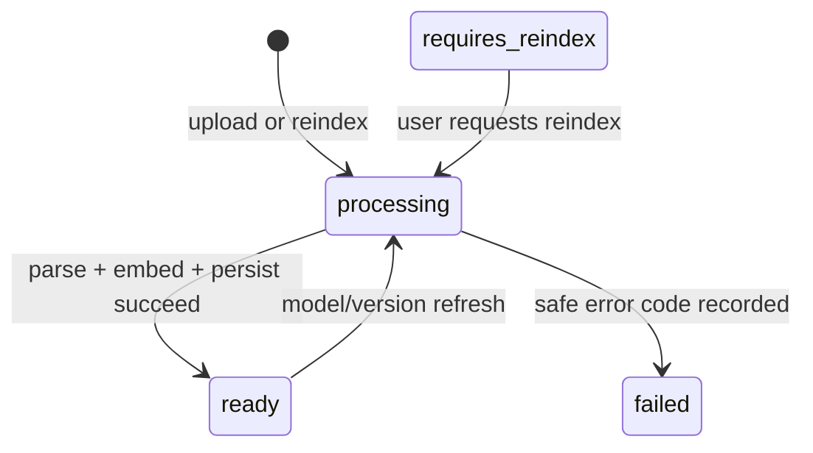

# ScholarPilot 系统设计

## 1. 定位

ScholarPilot 是可追溯学术文档 RAG 系统与检索实验平台。问答、学习计划和错题分析是业务服务；当前实现不宣称自主智能体、多步规划或工具循环。

## 2. 分层

- Vue 3：认证、文档、问答、状态、学习计划、错题和统计界面。
- FastAPI Router：协议校验、认证依赖和安全错误响应。
- Service：检索编排、学习计划、错题分析、PDF、embedding 和 LLM。
- Retriever：Exact、HNSW、BM25、Hybrid 的统一接口。
- SQLAlchemy/PostgreSQL：用户隔离业务数据、向量和聊天运行元数据。
- Experiments：数据加载、临时 demo 索引、指标、延迟、消融和结果序列化。

## 3. 目录

```text
backend/
├── alembic/                 # 正式数据库迁移
├── app/
│   ├── models/              # ORM
│   ├── rag/                 # retriever、RRF、证据与引用
│   ├── routers/             # REST API
│   ├── schemas/             # Pydantic 契约
│   └── services/            # PDF、embedding、LLM
└── tests/                   # 离线 pytest
experiments/
├── datasets/                # JSONL demo 数据
├── retrieval_evaluation.py
├── latency_benchmark.py
└── ablation.py
```

## 4. 文档状态机



旧 MVP 文档迁移为 `requires_reindex`，因为历史模型身份无法可靠推断。

## 5. 查询时序

```mermaid
sequenceDiagram
  participant F as Frontend
  participant A as Chat API
  participant R as RetrievalService
  participant D as PostgreSQL/pgvector
  participant L as LLMClient
  F->>A: question + retrieval_mode
  A->>R: user_id + query
  R->>D: validate embedding identity
  R->>D: exact/HNSW/BM25/hybrid retrieval
  D-->>R: ranked chunks
  R-->>A: sources + mode + parameters
  alt evidence below threshold
    A-->>F: evidence insufficient; LLM not called
  else evidence sufficient
    A->>L: numbered context [1], [2]
    L-->>A: real/mock/degraded result
    A->>A: validate citation numbers
    A-->>F: answer + sources + evidence_strength + runtime_metadata
  end
```

## 6. 检索隔离

向量检索 SQL 强制过滤 `Document.user_id` 和 `indexing_status=ready`。BM25 缓存以 `user_id` 为 key，只加载该用户 ready 文档；上传、删除和重索引会失效对应缓存。

## 7. 运行真实性

Embedding failure raises typed errors unless explicit fallback is enabled. Real LLM failures return a structured degraded result. `/health/details` exposes configured and active modes without触发模型下载。

## 8. 数据迁移

容器启动先执行 `python -m app.migration_runner`。全新数据库运行全部 Alembic revision；原 MVP 数据库在确认存在旧表且无 `alembic_version` 时先 stamp 基线，再执行增量迁移。

## 9. 已知扩展边界

BM25 缓存当前是单进程内存结构；线程池任务不持久；vector 列维度变更需要迁移；引用校验不执行语义蕴含判断。这些边界必须在部署和研究结论中保留。
