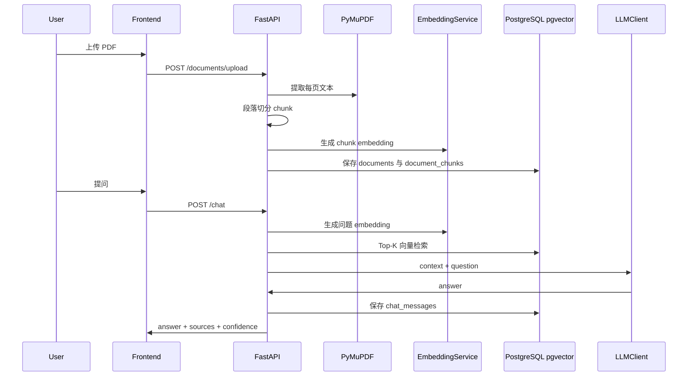

# ScholarPilot 系统设计

## 架构概览

ScholarPilot 采用前后端分离架构：

- 前端：Vue 3 + Vite + Element Plus，负责用户交互、资料上传、问答展示、引用展示和统计图表。
- 后端：FastAPI + SQLAlchemy + Pydantic，负责认证、业务 API、RAG 流程和 Agent 编排。
- 数据库：PostgreSQL + pgvector，统一存储业务表和向量数据。
- AI 层：sentence-transformers 生成 embedding；LLMClient 支持 mock 和 OpenAI-compatible API。

## 后端模块

```text
backend/app/
├── main.py              # FastAPI 入口
├── config.py            # 环境配置
├── database.py          # SQLAlchemy engine/session/init
├── models/              # ORM 模型
├── schemas/             # Pydantic Schema
├── routers/             # REST API
├── services/            # PDF、embedding、LLM
├── rag/                 # Agent 与检索
└── utils/               # JWT、安全依赖
```

## API 设计

认证：

- POST /auth/register
- POST /auth/login
- GET /auth/me

文档：

- POST /documents/upload
- GET /documents
- GET /documents/{document_id}
- DELETE /documents/{document_id}

问答：

- POST /chat
- GET /chat/history
- GET /chat/sessions

学习计划：

- POST /study-plan/generate
- GET /study-plan

错题：

- POST /mistakes
- GET /mistakes
- GET /mistakes/statistics

统计：

- GET /dashboard/summary

## RAG 数据流



## 扩展点

- 引入 Alembic 进行数据库迁移管理。
- 引入 OCR 支持扫描 PDF。
- 加入 hybrid search、reranker 和引用一致性检测。
- 将 Agent 扩展为工具调用式规划器。
- 引入用户学习画像，实现个性化推荐。

